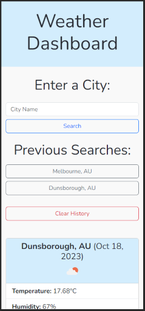

# 5-Day Forecasts
(```5-day-forecasts``` - Module 6 Challenge)

A 5-Day Weather-Forecast App.


## Description
- This application allows you to get the current weather for any city you search for!
    - It will display the current weather for the city, as well as the forecasted weather for 5 days in 24-hour increments from the time searched.
    - The weather information returned consists of simple temperature, humidity and wind-speed readouts, as well as an icon to indicate the conditions.
    - Previous searches are saved to your `localStorage` and rendered on-screen in the form of buttons, allowing you to easily re-load a previously searched city.
- It is written in HTML, CSS and plain JS, leveraging [OpenWeather API](https://openweathermap.org/) for weather data and [Day.js](https://day.js.org/en/) for parsing dates, while using [Bootstrap v5.3.2](https://getbootstrap.com/docs/5.3/getting-started/introduction/) for styling and layout.
- The application is designed to be responsive across devices, built with 4 break-points and flexible elements, allowing for ease of use no matter the device.

Example of app showing search results on an iPhone 12 Pro:



## Installation

To use the application, simply visit [https://trnigg.github.io/5-day-forecasts/](https://trnigg.github.io/5-day-forecasts/).
No further installion is required.

## Usage
1. In order to use **5-Day Forecasts**, visit the `URL` above. You will be met by the following homepage:

2. From there, enter the name of a city and click the 'Search' button or press the `enter` key.
    - **Note**: In case there are multiple cities of the save name and the search is not returning the desired city, it is possible to specify the country-code for the city after using a comma. 
    - **Example**: *Melbourne, AU*.
3. Your search results will then be rendered on-screen, and a 'Previous Searches' section will appear with cities previously searched for, including buttons that allow you to instantly re-load those cities' weather. You can also search for a new city.

4. If you wish to clear your city-search history, pressing the 'Clear History' button will allow you to do that.


## Roadmap / Know Bugs
The following is a non-exhaustive list of items I would like to address with more development time in the future:

### UI
- Desktop:
    - Desktop UI does not efficiently use the space available to it prior to a search taking place.
        - Remedy this by centering (removing the grid structure) before a search and only move it aside after.
- Mobile:
    - Inputs and buttons should be a little larger for usability.
    - Previous Searches section could be made collapsible. 
- Universal: 
    - Currently when a search fails, the user is notified via 2 almost identical prompts because of the way the API calls are made (2 calls seperately).
        - The `JS` API calls could be restructured to make the calls simultaneously and thereby only notify once, and/or;
        - preferably remove pop-up alerts entirely and use 'modals' for error-handling.
    - `<header>` and `<body>` height combine to be larger than the viewport even when nothing has been rendered yet; this is unnecessary and undesirable. 

### Features
- The app would benefit from a feature allowing 'Previous Searches" buttons to be individually removed and cleared from `localStorage` (possibly with an 'X' on each), rather than only being able to remove all previous searches at once.


## License
MIT License.

Please refer to the license section in the repo for further information.

